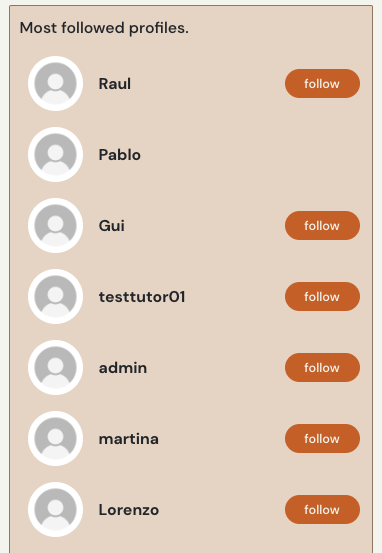

# Coffeeie
Coffeeie is a community for coffee lovers. With the aim of sharing experiences and connecting people around Dublin. With a social network-style, that seeks interactivity between users, encouraging them to post their experiences. It was developed thinking of anyone who enjoys good coffee or is interested in coffee culture.

- The repository for the DRF-API associated with this project is available [HERE](https://github.com/PEmbarach/drf-api-coffeeie). The installation, set up, and deployment steps for this section of the project have also been included in the README linked to the DRF-API. 

#### DEPLOYED BACKEND API [LINK](https://drf-api-coffeeie.herokuapp.com/)
#### DEPLOYED FRONTEND [LINK - LIVE SITE](https://coffeeie-p5.herokuapp.com/)
#### DEPLOYED BACKEND [REPOSITORY](https://github.com/PEmbarach/drf-api-coffeeie)


The live link for "Coffeie" can be found [HERE](https://project5-red-crayon.onrender.com)

## Table of Contents
+ [UX](#ux "UX")
  + [Site Purpose](#site-purpose "Site Purpose")
  + [Site Goal](#site-goal "Site Goal")
  + [Audience](#audience "Audience")
  + [Communication](#communication "Communication")
  + [Current User Goals](#current-user-goals "Current User Goals")
  + [New User Goals](#new-user-goals "New User Goals")
+ [User Stories](#user-stories "User Stories")
+ [Design](#design "Design")
  + [Colour Scheme](#colour-scheme "Colour Scheme")
  + [Typography](#typography "Typography")
+ [Features](#features "Features")
  + [Existing Features](#existing-features "Existing Features")
  + [Testing](#testing "Testing")
  + [Validator Testing](#validator-testing "Validator Testing")
  + [Unfixed Bugs](#unfixed-bugs "Unfixed Bugs")
+ [Technologies Used](#technologies-used "Technologies Used")
  + [Main Languages Used](#main-languages-used "Main Languages Used")
+ [Components](#components "Components")
+ [Deployment](#deployment "Deployment")
+ [Credits](#credits "Credits")
  + [Content](#content "Content")
  + [Media](#media "Media")

## UX

### Site Purpose:
Coffeeie is a community for coffee lovers. With the aim of sharing experiences and connecting people around Dublin.

### Site Goal:
Coffeeie aims to promote and rank different types of blends and coffee seeds from the most diverse places in the world that we can find in Dublin.

### Audience:
Anyone who enjoys good coffee or is interested in coffee culture.

### Communication:
The social network-style layout presents posts from different users, allowing interaction between them through likes, comments and following your favorite users or saving posts of interest.

### Current User Goals:
To keep users coming back again & again to see what is new in terms of news & events, as well as to follow up with other users that they follow.

### New User Goals:
To engage the user in a meaningful way, and encourage them to explore everything that the site has to offer.

### Future Goals:
- To provide different types of user accounts, so that access is restricted for who may publish specific types of content, such as news articles & events.
- Provide the ability for users to send private messages to either another user, or a group of users.
- To expand the events section & provide a google maps location for each event, so that users may understand in more detail where an even is to be hosted.

## User Stories
I have included links to the [GitHub Issues](https://github.com/CluelessBiker/project5-red-crayon/issues) for this project, as well as the [KANBAN board](https://github.com/users/CluelessBiker/projects/2).

Please also find a full list of the Epics, User stories, & story points typed up [HERE](src/assets/userstories.md).

## Design

### Wireframes:

##### Home Page - Desktop: 


##### Sign Up Page:


##### SignIn Page:


##### Logged Home Page:


##### Create Post Page:


##### Profile Page:


##### Contact Page:


### Database Schema:
This has been uploaded to the Backend README, which can be found [HERE](https://github.com/PEmbarach/drf-api-coffeeie).

### Colour Scheme:


### Typography:
All fonts were obtained from the Google Fonts library. I chose the following font for the page:
1. DM Sans
s

## Features

### Existing Features:

#### Header + NavBar menu:


s

##### Header + NavBar - Mobile:


#### Logged Header + NavBar menu:


#### 404 Page Not Found:


#### Popular Profiles:



#### Create a Post:


#### Sign in, Sign up & Contact:

##### Sigin:


##### Sign-up:


##### Contact:


### Features Left to Implement:
- Integration with Maps with the precise location of where to find a certain cafe.
- The ability to leave comments on articles & events
- Notifications when a user receives a new follower, comment, or like.
- Premium user level.
- Promotions and discounts page for premium users.

## Testing

### Manual Testing:
1. SignUpForm gives 400 error:
 - Resolved by changing `password` to `password1` in form fields & variable keys.
2. 500 server error:
 - Resolved with the aid of tutor support. All database migrations for both the Django project & apps needed to be cleared & remigrated. The precise steps for this have been documented in the README for the deployed backend API.
3. CRUD functionality has been tested for each of the following: Posts | Articles | Events | Comments | Likes | Follow | Profile
 - Likes & Follow may only be created & deleted
 - Profile may only be updated
4. All nav links open to the correct page.
5. All external links open to a new browser window.
6. Pages intended for logged-in users only will redirect logged-out users back to the home page.
7. Users attempting to edit content that they did not publish are redirected back to the home page.
8. Users are able to create a new account.
9. Users with an existing account are able to log in.
10. Each user has the ability to log out.

### Validator Testing
1. CSS files pass through the [Jigsaw validator](https://jigsaw.w3.org/css-validator/) with no issues found.


2. The page has an excellent Accessibility rating in Lighthouse:


4. Tested the site opens in Brave, Chrome, Safari, Opera & on a mobile device without issues.

### Unfixed Bugs
- An error was identified by Martina (mentor) that froze the page when an image with more than 2MB was loaded, generating a 400 bad request. I identified the error, which is the lack of an error alert in PostCreateForm.js. The same was fixed by following the Moments Walkthrough lessons.


## Technologies Used
### Main Languages Used
- HTML5
- CSS3
- Javascript
- Python
- SQL - Postgres

### Frameworks, Libraries & Programs Used
- Google Fonts : For the site fonts.
- Font Awesome : To add icons to the NavBar, like and comments buttons.
- GitPod : To build the project & create the JSX & CSS files before pushing the project to Github.
- GitHub : To store my repository for submission.
- Balsamiq : Was used to create mockups of the project prior to starting.
- Am I Responsive? : To ensure the project looked good across all devices.
- Django : Used to build the backend database that serves as an API for the front-end project.
- React-Bootstrap : The styling library that has aided to the layout of the site, and which was introduced to us during the course of the program.
- ReactJS : To build the components that would collectively form the front-end application.

## Components
Several components have been implemented within this project that have been reused throughout the project:
1. axiosDefault.js : for ease of communication with the backend API.
2. Asset.js : to supply the loading spinner & user avatar throughout the site.
3. DropdownMenu.js : to allow users to edit/delete their Profile & Posts.
4. CurrentUserContext.js : confirm users logged-in status to determine what functionality is available to that user.
5. ProfileDataContext.js : provide un/follow ability to other users across Popular Profile & Profile Page components.
6. ToggleCollapse.js : whilst this component has only been applied to the NavBarMini, it could in theory be applied to additional dropdown menus installed into the site in the future to allow for the automatic collapse of an element upon mouse click.
7. useRedirect.js : redirects a user to another page if they are not authorised to be on the page they are trying to access.
8. utils.js : supplies functionality to all of the components that utilise the Infinite Scroll.


## Deployment
The site was deployed to Heroku. The steps to deploy are as follows:
1. Launch the gitpod workspace.
2. Install ReactJS:
```
npx create-react-app . --use-npm
npm start
```
2. Install the following packages using the command `npm install`:
```
react-bootstrap@1.6.3 bootstrap@4.6.0
react-router-dom@5.3.0
axios
react-infinite-scroll-component
msw --save-dev
jwt-decode
-g eslint
```
3. Git add, commit, and push changes to gitpod.
4. Create the project app on Heroku, and link the GitHub repository by navigating to the 'Deploy' tab.

### Connecting to the API:
1. Navigated to the Heroku app of the project DRF-API, and under the Settings tab, added the following configvars:
- Key: CLIENT_ORIGIN | Value: https://react-app-name.herokuapp.com
- Key: CLIENT_ORIGIN_DEV | Value: https://gitpod-browser-link.ws-eu54.gitpod.io
2. Check that the trailing slash `\` at the end of both links has been removed, and save the configvar pairs.
3. Install the Axios package, & create supporting `axiosDefaults.js` as shown in [Moments Walkthrough](https://github.com/Code-Institute-Solutions/moments/blob/cf955d2f2e6f70f61c92d1f9de85558d8e49f3a8/src/api/axiosDefaults.js).

### Deploy to Heroku:
1. In the `scripts` section of `package.json` in gitpod, added the following command:
```
"heroku-prebuild": "npm install -g serve",
```
2. Add Procfile to project root & populate with the following:
```
web: serve -s build
```
3. Repeat the steps of git add/commit/push.
4. Deploy the project via the deploy button on Heroku.


## Credits

### Content
- Code Institute: The creation of this project was only possible due to the knowledge passed through the Moments walkthrough, which I followed step by step and formed the foundation of this project.
- [Martina Terlevic](https://github.com/SephTheOverwitch): My mentor, who directed me and helped to validate and adapt my idea in this project.
- A special thanks to the team of tutors, who in my moments of frustration had the patience and wisdom to help me solve the problems I faced.


### Media
- 404 Error Graphic from 
- Images for the Articles, Events & Posts made on the site have been accumulated from numerous sources on Twitter & Instagram. I do not have the information of the original content creator for these memes.
